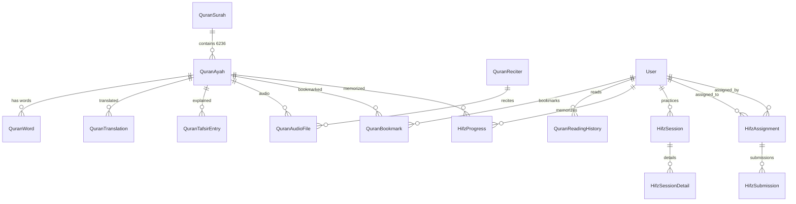

# 🏗️ Masjid App — DB Structure, Quran Architecture & Teacher Mode

Bhai ye report tumhare har sawaal ka visual answer hai.

---

## 1. CURRENT DB STRUCTURE (Abhi Kya Hai — 32 Tables)

```mermaid
erDiagram
    User ||--o| UserSettings : has
    User ||--o{ MasjidStaff : works_at
    User ||--o{ UserMasjidFollow : follows
    User ||--o{ UserNotification : receives
    User ||--o{ DonationLog : donates
    User ||--o{ UserPermission : permissions
    User ||--o{ UserDevice : devices

    Masjid ||--o| MasjidSettings : has
    Masjid ||--o{ MasjidStaff : managed_by
    Masjid ||--o{ UserMasjidFollow : followed_by
    Masjid ||--o{ MasjidAnnouncement : posts
    Masjid ||--o{ DonationLog : receives
    Masjid ||--o{ ManualDonationLog : cash
    Masjid ||--o{ MasjidExpenseLog : expenses
    Masjid ||--o{ MonthlyFinanceSummary : summaries
    Masjid ||--o| MasjidFinanceSettings : finance_config

    GuestProfile ||--o| UserSettings : guest_settings
```



### Tables by Module:

| Module | Tables | Count |
|--------|--------|-------|
| **Core** | `user`, `masjid`, `masjid_staff`, `guest_profile` | 4 |
| **Settings** | `user_settings`, `masjid_settings` | 2 |
| **Community** | `user_masjid_follow`, `masjid_announcement`, `masjid_qr_order`, `masjid_analytics_event`, `pre_generated_qr_code`, `user_notification`, `donation_log` | 7 |
| **Finance** | `manual_donation_log`, `masjid_expense_log`, `monthly_finance_summary`, `masjid_finance_settings`, `masjid_worker` | 5 |
| **Auth/Security** | `permission`, `user_permission`, `role_permission`, `token_blocklist`, `verification_code` | 5 |
| **Metadata** | `masjid_application`, `image_fingerprint`, `application_audit_log`, `audit_log`, `app_settings`, `popup` | 6 |
| **Prayer/Location** | `prayer_zone_calendar`, `hijri_date_oracle`, `geocoding_cache`, `monthly_schedule_cache`, `zone_alias`, `user_device` | 6 |
| **Quran (BASIC!)** | `quran_page` ← SIRF EK TABLE! | 1 |
| | **TOTAL** | **~36** |

### Current `quran_page` Table (Bahut Simple):
```
┌────────────────────────────────────────┐
│           quran_page                    │
├────────────────────────────────────────┤
│ page_number  (BigInteger, PK)          │
│ verses       (JSON blob — raw dump)    │
│ is_cached    (Boolean)                 │
│ last_updated (DateTime)                │
└────────────────────────────────────────┘
  ⚠️ No surah info, no juz, no translation,
     no audio, no bookmarks, no hifz — KUCH NAHI!
```

---

## 2. NEW DB STRUCTURE (Quran Add Karne Ke Baad — 50 Tables)

### Naye 14 Quran Tables:



### Har Naye Table Ka Detail:

#### 📖 Quran Core (5 tables — STATIC data, ek baar import)

```
┌─────────────────────────────────────────────────────┐
│ 1. quran_surah  (114 rows — never changes)          │
├─────────────────────────────────────────────────────┤
│ id              BigInteger PK                        │
│ number          Integer (1-114) UNIQUE               │
│ name_arabic     String "الفاتحة"                     │
│ name_simple     String "Al-Fatihah"                  │
│ name_complex    String "Al-Fātiĥah"                 │
│ name_translation String "The Opener"                 │
│ revelation_place String "makkah"/"madinah"           │
│ revelation_order Integer                             │
│ verses_count    Integer                              │
│ pages           JSON [1, 1]                          │
│ bismillah_pre   Boolean                              │
│ version         Integer (delta sync)                 │
│ created_at      DateTime                             │
│ updated_at      DateTime                             │
└─────────────────────────────────────────────────────┘

┌─────────────────────────────────────────────────────┐
│ 2. quran_ayah  (6,236 rows — never changes)         │
├─────────────────────────────────────────────────────┤
│ id              BigInteger PK                        │
│ surah_id        BigInteger FK → quran_surah          │
│ ayah_number     Integer (within surah)               │
│ verse_key       String "2:255" UNIQUE                │
│ juz_number      Integer (1-30)                       │
│ hizb_number     Integer (1-60)                       │
│ ruku_number     Integer (1-556)                      │
│ manzil_number   Integer (1-7)                        │
│ page_number     Integer (1-604)                      │
│ sajdah_type     String nullable ("recommended"/"obligatory") │
│ text_uthmani    Text "بِسْمِ ٱللَّهِ..."            │
│ text_indopak    Text                                 │
│ text_imlaei     Text (simple Arabic)                 │
│ version         Integer                              │
│ INDEX: (surah_id), (juz_number), (page_number)       │
└─────────────────────────────────────────────────────┘

┌─────────────────────────────────────────────────────┐
│ 3. quran_word  (~77,000 rows)                       │
├─────────────────────────────────────────────────────┤
│ id              BigInteger PK                        │
│ ayah_id         BigInteger FK → quran_ayah           │
│ position        Integer (1, 2, 3...)                 │
│ text_uthmani    String                               │
│ text_indopak    String                               │
│ translation     String "In (the) name"               │
│ transliteration String "bis'mi"                      │
│ version         Integer                              │
└─────────────────────────────────────────────────────┘

┌─────────────────────────────────────────────────────┐
│ 4. quran_juz  (30 rows)                             │
├─────────────────────────────────────────────────────┤
│ id              BigInteger PK                        │
│ juz_number      Integer (1-30) UNIQUE                │
│ first_verse_key String "1:1"                         │
│ last_verse_key  String "2:141"                       │
│ verses_count    Integer                              │
│ surahs          JSON ["Al-Fatihah", "Al-Baqarah"]   │
│ version         Integer                              │
└─────────────────────────────────────────────────────┘

┌─────────────────────────────────────────────────────┐
│ 5. quran_reciter  (~50-100 rows)                    │
├─────────────────────────────────────────────────────┤
│ id                 BigInteger PK                     │
│ api_recitation_id  Integer (Quran.com ID)            │
│ name               String "Mishary Rashid Alafasy"   │
│ arabic_name        String "مشاري راشد العفاسي"       │
│ style              String "murattal"/"mujawwad"      │
│ reciter_type       String "ayah_by_ayah"/"chapter"   │
│ is_default         Boolean (hamare top 5)            │
│ version            Integer                           │
└─────────────────────────────────────────────────────┘
```

#### 📚 Content Cache (3 tables — HYBRID, demand pe import)

```
┌─────────────────────────────────────────────────────┐
│ 6. quran_translation  (demand pe grow hoga)         │
├─────────────────────────────────────────────────────┤
│ id              BigInteger PK                        │
│ ayah_id         BigInteger FK → quran_ayah           │
│ resource_id     Integer (Quran.com translation ID)   │
│ language        String "ur"/"en"/"hi"                │
│ author_name     String "Dr. Mustafa Khattab"         │
│ text            Text (translated text)               │
│ version         Integer                              │
│ UNIQUE: (ayah_id, resource_id)                       │
└─────────────────────────────────────────────────────┘

┌─────────────────────────────────────────────────────┐
│ 7. quran_tafsir_entry  (demand pe grow hoga)        │
├─────────────────────────────────────────────────────┤
│ id              BigInteger PK                        │
│ ayah_id         BigInteger FK → quran_ayah           │
│ resource_id     Integer (Quran.com tafsir ID)        │
│ language        String                               │
│ author_name     String "Ibn Kathir"                  │
│ text            Text (tafsir content)                │
│ version         Integer                              │
│ UNIQUE: (ayah_id, resource_id)                       │
└─────────────────────────────────────────────────────┘

┌─────────────────────────────────────────────────────┐
│ 8. quran_audio_file  (demand pe grow hoga)          │
├─────────────────────────────────────────────────────┤
│ id              BigInteger PK                        │
│ reciter_id      BigInteger FK → quran_reciter        │
│ ayah_id         BigInteger FK → quran_ayah           │
│ surah_number    Integer                              │
│ audio_url       String (QuranicAudio.com link)       │
│ format          String "mp3"                         │
│ version         Integer                              │
│ UNIQUE: (reciter_id, ayah_id)                        │
└─────────────────────────────────────────────────────┘
```

#### 👤 User Data (3 tables — per-user data)

```
┌─────────────────────────────────────────────────────┐
│ 9. quran_bookmark                                    │
├─────────────────────────────────────────────────────┤
│ id          BigInteger PK                            │
│ user_id     BigInteger FK → user                     │
│ ayah_id     BigInteger FK → quran_ayah               │
│ folder_name String "Favorites" / "Duas" / custom     │
│ note        Text (user note)                         │
│ version     Integer                                  │
│ created_at  DateTime                                 │
└─────────────────────────────────────────────────────┘

┌─────────────────────────────────────────────────────┐
│ 10. quran_reading_history                            │
├─────────────────────────────────────────────────────┤
│ id                    BigInteger PK                   │
│ user_id               BigInteger FK → user            │
│ ayah_id               BigInteger FK → quran_ayah      │
│ page_number           Integer                         │
│ surah_number          Integer                         │
│ reading_duration_secs Integer                         │
│ created_at            DateTime                        │
│ INDEX: (user_id, created_at)                          │
└─────────────────────────────────────────────────────┘

┌─────────────────────────────────────────────────────┐
│ 11. quran_user_settings                              │
├─────────────────────────────────────────────────────┤
│ id                    BigInteger PK                   │
│ user_id               BigInteger FK → user UNIQUE     │
│ preferred_script      String "indopak"/"uthmani"      │
│ preferred_reciter_id  BigInteger FK → quran_reciter   │
│ preferred_translation Integer (resource_id)           │
│ font_size             Integer default=18              │
│ mushaf_mode           String "page"/"scroll"          │
│ version               Integer                         │
└─────────────────────────────────────────────────────┘
```

#### 🧠 Hifz Engine (3 tables)

```
┌─────────────────────────────────────────────────────┐
│ 12. hifz_progress  (per user × per ayah)            │
├─────────────────────────────────────────────────────┤
│ id                BigInteger PK                      │
│ user_id           BigInteger FK → user               │
│ ayah_id           BigInteger FK → quran_ayah         │
│ status            String "new"/"learning"/            │
│                          "reviewing"/"memorized"     │
│ ease_factor       Float (FSRS — default 2.5)         │
│ interval_days     Integer (days until next review)   │
│ next_review_date  Date                               │
│ repetition_count  Integer                            │
│ last_reviewed_at  DateTime                           │
│ streak            Integer                            │
│ version           Integer                            │
│ UNIQUE: (user_id, ayah_id)                           │
│ INDEX: (user_id, next_review_date)  ← daily queue    │
└─────────────────────────────────────────────────────┘

┌─────────────────────────────────────────────────────┐
│ 13. hifz_session  (practice log)                    │
├─────────────────────────────────────────────────────┤
│ id              BigInteger PK                        │
│ user_id         BigInteger FK → user                 │
│ session_type    String "sabaq"/"sabqi"/"manzil"/     │
│                        "self_test"                   │
│ started_at      DateTime                             │
│ ended_at        DateTime                             │
│ ayahs_practiced Integer                              │
│ mistakes_count  Integer                              │
│ score           Float (0-100)                        │
│ details         JSON [{"ayah":"2:3","grade":"good"}] │
│ version         Integer                              │
└─────────────────────────────────────────────────────┘

┌─────────────────────────────────────────────────────┐
│ 14. hifz_daily_target                               │
├─────────────────────────────────────────────────────┤
│ id                  BigInteger PK                    │
│ user_id             BigInteger FK → user             │
│ daily_new_ayahs     Integer default=5                │
│ sabqi_days          Integer default=7                │
│ manzil_juz_per_day  Integer default=1                │
│ review_limit        Integer default=100              │
│ new_lesson_guard    Boolean default=True             │
│ preferred_test_mode String "hidden"/"first_letter"   │
│ version             Integer                          │
└─────────────────────────────────────────────────────┘
```

#### 👨‍🏫 Ustaad Mode (2 tables)

```
┌─────────────────────────────────────────────────────┐
│ 15. hifz_assignment                                  │
├─────────────────────────────────────────────────────┤
│ id              BigInteger PK                        │
│ teacher_id      BigInteger FK → user                 │
│ student_id      BigInteger FK → user                 │
│ masjid_id       BigInteger FK → masjid (optional)    │
│ assignment_type String "sabaq"/"sabqi"/"manzil"      │
│ start_verse_key String "2:1"                         │
│ end_verse_key   String "2:10"                        │
│ due_date        Date                                 │
│ status          String "pending"/"submitted"/"graded"│
│ teacher_notes   Text                                 │
│ version         Integer                              │
│ created_at      DateTime                             │
│ INDEX: (student_id, status)                          │
│ INDEX: (teacher_id, status)                          │
└─────────────────────────────────────────────────────┘

┌─────────────────────────────────────────────────────┐
│ 16. hifz_submission                                  │
├─────────────────────────────────────────────────────┤
│ id              BigInteger PK                        │
│ assignment_id   BigInteger FK → hifz_assignment      │
│ student_id      BigInteger FK → user                 │
│ submitted_at    DateTime                             │
│ audio_url       String (recording upload, optional)  │
│ self_grade      String "easy"/"good"/"hard"          │
│ teacher_grade   String "A"/"B"/"C"/"F" (nullable)    │
│ teacher_feedback Text                                │
│ mistakes        JSON [{"verse":"2:3","word":5,       │
│                   "type":"skipped"}]                  │
│ status          String "submitted"/"reviewed"        │
│ version         Integer                              │
└─────────────────────────────────────────────────────┘
```

### Final DB Count:

| Module | Before | After |
|--------|--------|-------|
| Core, Settings, Community, Finance | 18 | 18 (no change) |
| Auth/Security | 5 | 5 (no change) |
| Metadata/Prayer | 13 | 13 (no change) |
| **Quran** | **1** (sirf quran_page) | **16 new tables** |
| **TOTAL** | **~36** | **~52 tables** |

---

## 3. DATA KAHAN RAHEGA? (DB mein ya Project Files mein?)

```
                ❌ NAHI — Project files mein NAHI
                ✅ HAN — PostgreSQL DB mein!

┌────────────────────────────────────────────────────┐
│               PostgreSQL Database                   │
│          (jo Masjid app pehle se use karta hai)     │
├────────────────────────────────────────────────────┤
│                                                    │
│  EXISTING DATA          │  NEW QURAN DATA           │
│  ─────────────          │  ──────────────           │
│  users                  │  quran_surah (114 rows)   │
│  masjids                │  quran_ayah (6,236 rows)  │
│  prayers                │  quran_word (~77K rows)   │
│  donations              │  quran_translation        │
│  announcements          │  quran_tafsir_entry       │
│  ...                    │  quran_audio_file         │
│                         │  quran_bookmark           │
│                         │  hifz_progress            │
│                         │  ...                      │
│                                                    │
│  SAME DATABASE! Koi alag server nahi chahiye.      │
│  Quran data = ~200 MB extra in existing PostgreSQL │
└────────────────────────────────────────────────────┘
```

> **Quran data hamare existing PostgreSQL DB mein rahega** — koi naya database, koi naya server nahi chahiye. Sirf new tables add honge existing DB mein. Total extra size = ~200 MB.

---

## 4. 🔄 HYBRID CACHING SYSTEM (Smart Auto-Select)

> Bhai tumne kaha "system khud select kare kis cheez ki demand zyada hai" — ye **Smart Hybrid Cache** hai!

```
USER REQUEST AATA HAI
        │
        ▼
┌─────────────────────────────┐
│  STEP 1: Check PostgreSQL   │   ← 1-5ms (FAST!)
│  Kya hamara DB mein hai?    │
└──────────┬──────────────────┘
           │
     ┌─────┴─────┐
     │           │
   HAI ✅     NAHI ❌
     │           │
     ▼           ▼
  Return    ┌──────────────────────────┐
  from DB   │ STEP 2: Fetch from       │
            │ Quran.com API            │   ← 200-500ms
            └──────────┬───────────────┘
                       │
                       ▼
            ┌──────────────────────────┐
            │ STEP 3: Save in our DB   │
            │ + Track demand counter   │
            └──────────┬───────────────┘
                       │
                       ▼
                  Return to user


NIGHTLY CELERY TASK (3 AM):
┌─────────────────────────────────────────────┐
│ "Smart Pre-fetch" Task                       │
│                                             │
│ 1. Check quran_cache_stats table            │
│ 2. Top 50 most-requested translations       │
│    that are NOT in our DB → PRE-FETCH       │
│ 3. Top 10 most-requested tafsirs            │
│    that are NOT in our DB → PRE-FETCH       │
│ 4. Top 10 most-played reciters              │
│    audio URLs not cached → PRE-FETCH        │
│                                             │
│ Result: Popular content auto-cached!         │
│ Rare content = on-demand API call            │
└─────────────────────────────────────────────┘
```

### Kya Pre-load Karenge vs Kya On-Demand:

| Data | Strategy | Kyun |
|------|----------|------|
| **Quran Text (Arabic, 3 scripts)** | ✅ PRE-LOAD (one-time import) | Ye NEVER changes, sirf 5 MB |
| **Word-by-word** | ✅ PRE-LOAD | 10 MB, frequently needed |
| **Juz/Surah metadata** | ✅ PRE-LOAD | Chhota data, always needed |
| **Top 3 Translations** (Urdu, English, Hindi) | ✅ PRE-LOAD | Most popular, ~30 MB |
| **Other Translations** (90+ languages) | 🔄 ON-DEMAND + auto-cache | Jab user maange tab fetch |
| **Top 3 Tafsirs** | ✅ PRE-LOAD | ~20 MB |
| **Other Tafsirs** | 🔄 ON-DEMAND + auto-cache | Rare demand |
| **Reciter metadata** | ✅ PRE-LOAD | Chhota, ~1 MB |
| **Audio URLs** | 🔄 ON-DEMAND + auto-cache | Bahut reciters hain |
| **Audio FILES** | ❌ NEVER store — stream from QuranicAudio.com | Terabytes bachenge |
| **User bookmarks/progress** | ✅ ALWAYS in our DB | User-specific |

### New Table for Smart Caching:

```
┌─────────────────────────────────────────────────────┐
│ quran_cache_stats  (auto-populated)                  │
├─────────────────────────────────────────────────────┤
│ id              BigInteger PK                        │
│ resource_type   String "translation"/"tafsir"/       │
│                        "audio"                       │
│ resource_id     Integer                              │
│ request_count   BigInteger (kitni baar maanga gaya)  │
│ last_requested  DateTime                             │
│ is_pre_cached   Boolean (kya hamne pre-load kiya)    │
│ INDEX: (resource_type, request_count DESC)            │
└─────────────────────────────────────────────────────┘
```

---

## 5. 📁 QURAN MODULE KA PURA FOLDER STRUCTURE

```
app/
├── models/
│   ├── core.py              ← User, Masjid (NO CHANGE)
│   ├── settings.py          ← (NO CHANGE)
│   ├── community.py         ← (NO CHANGE)
│   ├── finance.py           ← (NO CHANGE)
│   ├── metadata.py          ← QuranPage (DEPRECATED, keep for backward compat)
│   ├── quran.py             ← 🆕 ALL 16 new Quran models
│   └── __init__.py          ← ✏️ Import new models
│
├── schemas/
│   ├── auth.py              ← (NO CHANGE)
│   ├── masjid.py            ← (NO CHANGE)
│   ├── prayer.py            ← ✏️ Remove old QuranVerse/QuranPageDisplay
│   └── quran.py             ← 🆕 All Quran schemas (40+ schemas)
│
├── services/
│   ├── quran_service.py     ← ❌ DELETE (replaced by package)
│   └── quran/               ← 🆕 QURAN SERVICE PACKAGE
│       ├── __init__.py
│       ├── api_client.py        # Quran.com API client (rate-limited httpx)
│       ├── surah_service.py     # Surah listing, detail
│       ├── ayah_service.py      # Ayah by chapter/page/juz/key
│       ├── translation_service.py # Translation with hybrid cache
│       ├── tafsir_service.py    # Tafsir with hybrid cache
│       ├── audio_service.py     # Audio URL resolution
│       ├── search_service.py    # Full-text search
│       ├── bookmark_service.py  # User bookmarks
│       ├── reading_service.py   # Reading history + khatam tracker
│       ├── hifz_service.py      # 🧠 FSRS algorithm + Sabaq system
│       └── ustaad_service.py    # 👨‍🏫 Teacher-Student assignments
│
├── api/v1/endpoints/user/
│   ├── quran.py             ← ❌ DELETE (replaced by package)
│   └── quran/               ← 🆕 QURAN API PACKAGE
│       ├── __init__.py          # Router registry
│       ├── surahs.py            # /api/quran/surahs/...
│       ├── ayahs.py             # /api/quran/ayahs/...
│       ├── translations.py      # /api/quran/translations/...
│       ├── tafsirs.py           # /api/quran/tafsirs/...
│       ├── audio.py             # /api/quran/audio/...
│       ├── search.py            # /api/quran/search/...
│       ├── bookmarks.py         # /api/quran/bookmarks/...
│       ├── reading.py           # /api/quran/reading/...
│       ├── hifz.py              # /api/quran/hifz/...
│       └── ustaad.py            # /api/quran/ustaad/...
│
├── tasks/
│   ├── schedule.py          ← (NO CHANGE)
│   └── quran_import.py      ← 🆕 Celery import tasks
│
├── core/
│   ├── config.py            ← ✏️ Add Quran config params
│   ├── feature_flags.py     ← ✏️ Add 6 Quran feature flags
│   └── constants.py         ← ✏️ Add Quran constants
│
└── alembic/versions/
    └── xxx_add_quran_module.py  ← 🆕 Migration for 16 tables
```

---

## 6. 👨‍🏫 TEACHING PARTNER vs TEACHER MODE — Full Breakdown

Bhai tumne sahi kaha — **Teaching Partner** (AI) aur **Teacher Mode** (Real Insaan) dono ALAG hain. Dono ka detail:

### 🤖 Teaching Partner (AI — On-Device)

```
YE KYA HAI:
  AI jo user ke phone pe chalta hai aur PRACTICE mein madad karta hai.
  Ye TEACHER nahi hai — ye "STUDY BUDDY" hai.

KYA KAREGA:
┌──────────────────────────────────────────────┐
│  USER BOLTA HAI (Audio)                      │
│           │                                  │
│           ▼                                  │
│  ┌──────────────────────────┐                │
│  │ whisper-tiny (75MB)      │  ← Phone pe    │
│  │ Audio → Text convert     │                │
│  └──────────┬───────────────┘                │
│             │                                │
│             ▼                                │
│  ┌──────────────────────────┐                │
│  │ Text Matching Engine     │  ← Pure code   │
│  │ Convert result vs        │    (no AI!)    │
│  │ actual Quran text        │                │
│  └──────────┬───────────────┘                │
│             │                                │
│             ▼                                │
│  ┌──────────────────────────┐                │
│  │ FEEDBACK:                │                │
│  │ ✅ "Sahi padha!"         │                │
│  │ ❌ "2:5 mein 3rd word    │                │
│  │    chhoot gaya"          │                │
│  │ ⚠️ "2:6 ke baad 2:8     │                │
│  │    padh diya, 2:7 miss"  │                │
│  └──────────────────────────┘                │
└──────────────────────────────────────────────┘

KAUNSA MODEL: tarteel-ai/whisper-tiny-ar-quran
SIZE: 75 MB (quantized)
RUNS ON: User ka phone (offline)
COST: ₹0
AI KI ZAROORAT: ✅ Sirf speech-to-text ke liye
TEACHER NAHI: ❌ Grade nahi dega, personality nahi
```

> [!IMPORTANT]
> **Teaching Partner mein KISI BHI API key ya server ki zaroorat NAHI!** Sab phone pe hota hai. User ko kuch karne ki zaroorat nahi — model app ke andar silently download ho jaata hai.

### 👨‍🏫 Teacher Mode (REAL INSAAN — Ustaad)

```
YE KYA HAI:
  REAL human teacher jo app ke through student ko padhaata hai.
  AI NAHI — INSAAN hai.

KAISE KAAM KAREGA:

  TEACHER (Real Person)              STUDENT
  ┌──────────────┐                  ┌──────────────┐
  │ App mein     │                  │ App mein     │
  │ "Teacher"    │                  │ "Student"    │
  │ role select  │                  │ role select  │
  └──────┬───────┘                  └──────┬───────┘
         │                                 │
         │  1. Teacher assigns Sabaq       │
         │  "Surah Baqarah: 1-10 yaad karo"│
         ├────────────────────────────────→│
         │                                 │
         │                    2. Student   │
         │                    practices    │
         │                    (with AI     │
         │                    Teaching     │
         │                    Partner)     │
         │                                 │
         │  3. Student submits            │
         │  "Done! Grade please"          │
         │←────────────────────────────────┤
         │                                 │
         │  4. Teacher reviews             │
         │  - Listens to recording         │
         │  - Marks mistakes               │
         │  - Gives grade (A/B/C/F)        │
         │  - Writes feedback              │
         │                                 │
         │  5. Grade sent back             │
         ├────────────────────────────────→│
         │                                 │
         │  "Grade: B                     │
         │   Feedback: 2:5 mein huroof    │
         │   ki adayagi pe dhyan do"      │
         │                                 │

  KAUNSA AI MODEL: ❌ KOI NAHI!
  TEACHER: ✅ Real insaan (Hafiz/Qari)
  COST: ₹0 (teacher volunteer ya masjid staff)
  AUTH: Hamare existing JWT system se
```

### Dono Saath Kaise Kaam Karenge:

```
┌────────────────────────────────────────────────────────────┐
│                     STUDENT KA DIN                          │
│                                                            │
│  🌅 Subah: Teacher ne Sabaq assign kiya                    │
│      → "Surah Al-Mulk: Ayah 1-5 yaad karo"                │
│                                                            │
│  📖 Practice Time: Student AI Teaching Partner ke saath     │
│      → Phone pe model chalta hai                           │
│      → Student bolta hai, AI check karta hai                │
│      → "2nd ayah mein 'tabaaraka' ke baad 'alladhi'        │
│         miss ho gaya" — AI batata hai                       │
│      → Student dubara try karta hai                         │
│      → AI: "✅ Ab sahi hai!"                                │
│                                                            │
│  ✅ Submit: Student "Submit" press karta hai                │
│      → Optional: Audio recording attach                    │
│      → Self-grade: "Good" (I think I did well)              │
│                                                            │
│  👨‍🏫 Review: Teacher app mein dekhta hai                    │
│      → Recording sunta hai (optional)                       │
│      → Progress check karta hai                             │
│      → Grade: "B+" + Feedback: "Accha, lekin 4th ayah      │
│        mein tajweed pe kaam karo"                           │
│                                                            │
│  📊 Dashboard: Student apni progress dekhta hai             │
│      → Heatmap, streak, weak areas                          │
└────────────────────────────────────────────────────────────┘
```

### Kaunsa AI Model Chunenge?

| Kaam | Model | Size | Kahan Chalega | Cost |
|------|-------|------|---------------|------|
| **Speech Recognition** (audio → text) | `whisper-tiny-ar-quran` | 75 MB | 📱 Phone | ₹0 |
| **Text Matching** (sahi ayah check) | Pure Python code (no model!) | 0 MB | 📱 Phone | ₹0 |
| **Teacher Mode** | ❌ No AI — Real insaan | 0 MB | N/A | ₹0 |

> [!TIP]
> **User ki API key ki ZAROORAT NAHI HAI** kyunki:
> 1. Teaching Partner = on-device model (no server)
> 2. Teacher Mode = real human (no AI)
> 3. Text matching = pure code (if-else logic, no AI)
> 
> **API key tab chahiye jab**: Future mein advanced Tajweed AI add karein (Phase 3). Tab bhi optional hoga — Gemini Flash-Lite se ₹17/user/month lagega.

---

## 7. Quick Answers Summary

| Sawaal | Jawab |
|--------|-------|
| **Current DB?** | 36 tables, sirf 1 basic QuranPage |
| **New DB?** | 52 tables (+16 Quran tables) |
| **Data kahan rahega?** | PostgreSQL mein — same DB, new tables |
| **Extra storage?** | ~200 MB (bahut kam!) |
| **Hybrid system?** | ✅ Smart auto-cache — popular = pre-load, rare = on-demand |
| **Audio files?** | ❌ Store NAHI — stream from QuranicAudio.com |
| **Teaching Partner?** | 🤖 AI on phone (75MB model, ₹0 cost) |
| **Teacher Mode?** | 👨‍🏫 Real insaan, no AI needed |
| **API key chahiye?** | ❌ Phase 1-2 mein NAHI. Phase 3 mein optional |
| **UI apna?** | ✅ 100% custom — data JSON mein aata hai |
| **Auth?** | ✅ Hamara existing JWT auth chalega |
| **Project name?** | ✅ "Masjid" (noted!) |
