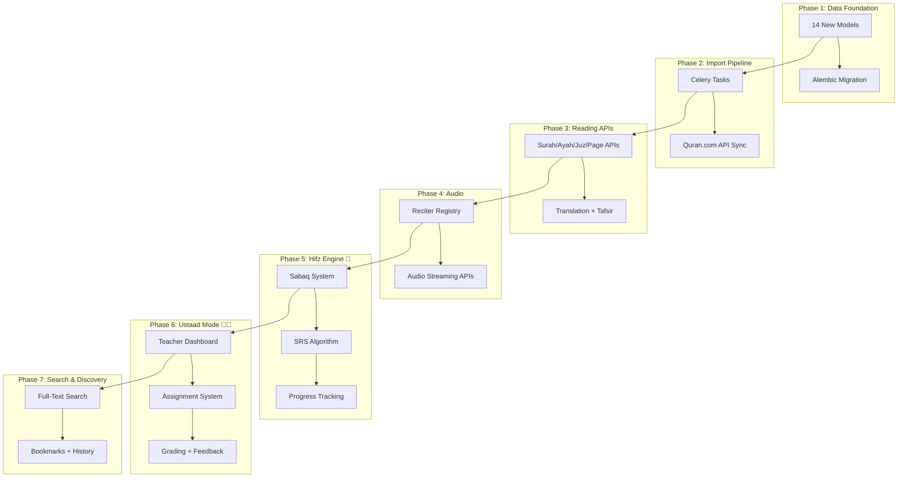
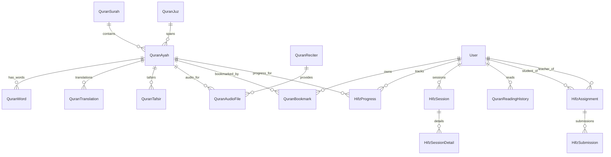
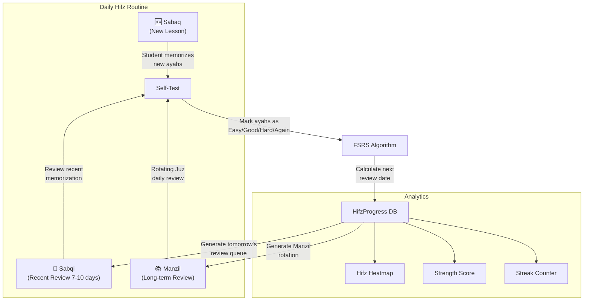
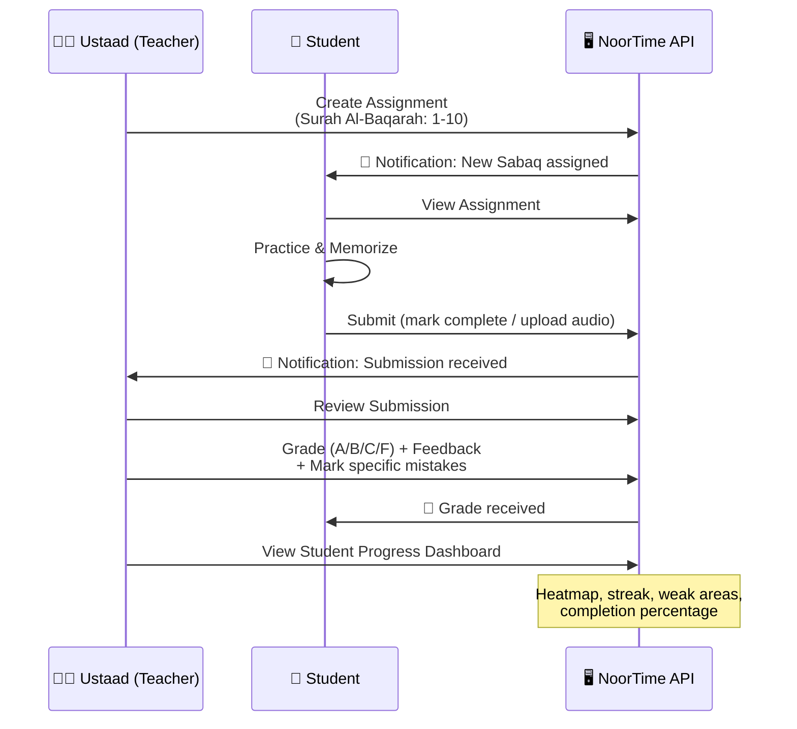

# 🕌 Smart Quran Module — NoorTime Masjid OS

## Masla (Problem)
Masjid OS mein abhi sirf ek basic `QuranPage` model hai jo page-based verse fetching karta hai (61 lines). Hame ek **Next-Level Smart Quran** banana hai jo Tarteel Quran aur Quran Companion se bhi zyada powerful ho — khaas taur pe **Hafiz** aur **Hifz students** ke liye.

## Background / Current State

### Existing Code (Minimal)
| Component | Location | Lines | What it does |
|-----------|----------|-------|-------------|
| Model | [metadata.py](file:///home/ubuntu/Masjid/app/models/metadata.py#L224-L229) | 6 | `QuranPage` — page_number + JSON blob |
| Service | [quran_service.py](file:///home/ubuntu/Masjid/app/services/quran_service.py) | 61 | Fetch page from Quran.com API v4, DB cache |
| Endpoint | [quran.py](file:///home/ubuntu/Masjid/app/api/v1/endpoints/user/quran.py) | 25 | `GET /api/quran/page/{page_number}` |
| Schema | [prayer.py](file:///home/ubuntu/Masjid/app/schemas/prayer.py#L51-L59) | 9 | `QuranVerse`, `QuranPageDisplay` |
| Feature Flag | [feature_flags.py](file:///home/ubuntu/Masjid/app/core/feature_flags.py) | 1 | `QURAN_AUDIO: False` |

### Data Source: Quran.com API v4
```
Base URL: https://api.quran.com/api/v4
```
- **No auth required** for read-only endpoints
- Rate-limited (monitor usage, implement client-side throttling)
- MP3 audio via `download.quranicaudio.com`
- 50+ reciters, word-by-word data, 100+ translations, 20+ tafsirs

---

## User Review Required

> [!IMPORTANT]
> **Hifz AI Feature (Phase 6.5 — Future)**: AI-based voice matching using `tarteel-ai/whisper-base-ar-quran` model requires GPU server aur significant infra. Kya ye Phase 1 mein chahiye ya baad mein? Plan mein abhi **manual teacher grading** rakh rahe hain, AI optional hai.

> [!WARNING]
> **Data Import Volume**: Full Quran import = 114 surahs + 6,236 ayahs + 604 pages + 30 juz + audio URLs. Initial import Celery task se hoga (~5-10 min). Kya **incremental import** (surah by surah on-demand) ya **bulk import** (one-shot full Quran) prefer karoge?

> [!IMPORTANT]
> **Existing `QuranPage` Model**: Current model bahut simple hai. Plan mein isko **replace** kar rahe hain proper normalized models se. Purana data migrate hoga ya fresh start? (Recommend: Fresh start since minimal data)

---

## Open Questions

> [!IMPORTANT]
> 1. **Quran Scripts**: Kaunsa script primary chahiye? Options:
>    - IndoPak (current) ✅
>    - Uthmani
>    - Imlaei (Simple Arabic)
>    - Multiple scripts support?
>
> 2. **Audio Priority**: Kaunse reciters default mein chahiye? Recommend top 5:
>    - Mishary Rashid Alafasy
>    - Abdul Rahman Al-Sudais
>    - Abdul Basit (Murattal)
>    - Mahmoud Khalil Al-Husary
>    - Maher Al Muaiqly
>
> 3. **Translation Languages**: Kaunsi translations chahiye initially?
>    - Urdu (Fateh Muhammad Jalandhri)
>    - English (Dr. Mustafa Khattab — Clear Quran)
>    - Hindi
>    - More?
>
> 4. **Teacher-Student Mode**: Kya ye Phase 1 mein chahiye ya baad mein? Isme teacher ko dashboard milega jahan wo student ka progress track karega.
>
> 5. **Frontend**: Project "Dumb Frontend" architecture follow karta hai (API-only). Quran module bhi pure API-based hoga. Mobile app consume karega. Confirm?

---

## Proposed Changes

Architecture ko **7 Phases** mein divide kiya hai. Har phase independent aur deployable hai.



---

### Phase 1: Data Foundation (14 New Database Models)

#### [NEW] [quran.py](file:///home/ubuntu/Masjid/app/models/quran.py) — Quran Domain Models



**14 Models Breakdown:**

| # | Model | Purpose | Key Columns |
|---|-------|---------|-------------|
| 1 | `QuranSurah` | 114 Surahs metadata | id, number, name_arabic, name_simple, name_complex, revelation_place, verses_count, pages[], juz_mapping(JSON), version |
| 2 | `QuranAyah` | 6,236 Verses | id, surah_id(FK), ayah_number, verse_key, juz_number, hizb_number, ruku_number, manzil_number, page_number, sajdah_type, text_uthmani, text_indopak, text_imlaei, version |
| 3 | `QuranWord` | Word-by-word data | id, ayah_id(FK), position, text_uthmani, text_indopak, translation_text, transliteration_text, version |
| 4 | `QuranJuz` | 30 Juz/Para info | id, juz_number, first_ayah_id(FK), last_ayah_id(FK), verses_count, version |
| 5 | `QuranTranslation` | Cached translations | id, ayah_id(FK), resource_id, language, author_name, text, version |
| 6 | `QuranTafsirEntry` | Cached tafsir content | id, ayah_id(FK), resource_id, language, author_name, text, version |
| 7 | `QuranReciter` | Reciter registry | id, api_recitation_id, name, style(murattal/mujawwad), reciter_type(ayah/chapter), version |
| 8 | `QuranAudioFile` | Audio URL cache | id, reciter_id(FK), ayah_id(FK), surah_number, audio_url, format, file_size, version |
| 9 | `QuranBookmark` | User bookmarks | id, user_id(FK), ayah_id(FK), folder_name, note, version |
| 10 | `QuranReadingHistory` | Reading tracker | id, user_id(FK), ayah_id(FK), page_number, surah_number, reading_duration_seconds, created_at |
| 11 | `HifzProgress` | Per-ayah memorization state | id, user_id(FK), ayah_id(FK), status(new/learning/reviewing/memorized), ease_factor, interval_days, next_review_date, repetition_count, last_reviewed_at, streak, version |
| 12 | `HifzSession` | Daily Hifz session log | id, user_id(FK), session_type(sabaq/sabqi/manzil/self_test), started_at, ended_at, ayahs_count, mistakes_count, score, version |
| 13 | `HifzAssignment` | Teacher → Student task | id, teacher_id(FK), student_id(FK), masjid_id(FK), assignment_type(sabaq/sabqi/manzil), start_ayah_id(FK), end_ayah_id(FK), due_date, status(pending/submitted/graded), notes, version |
| 14 | `HifzSubmission` | Student submission + grading | id, assignment_id(FK), student_id(FK), submitted_at, audio_recording_url, teacher_grade(A/B/C/F), teacher_feedback, mistakes(JSON), status(submitted/reviewed), version |

**All models will follow project conventions:**
- `BigInteger` for all IDs and FKs
- `version` column for Delta Sync
- `created_at`, `updated_at` timestamps
- Proper indexes on frequently queried columns
- SQLAlchemy relationships with `selectinload` hints

#### [MODIFY] [metadata.py](file:///home/ubuntu/Masjid/app/models/metadata.py)
- `QuranPage` model ko **deprecate** karenge (keep for backward compat, mark with comment)
- New models will be in separate `quran.py` file

#### [MODIFY] [__init__.py](file:///home/ubuntu/Masjid/app/models/__init__.py)
- Import all 14 new models

#### [NEW] Alembic Migration
- `alembic/versions/xxx_add_quran_module_models.py`
- Create all 14 tables with indexes, constraints, FKs

---

### Phase 2: Data Import Pipeline (Celery Tasks)

#### [NEW] [quran_import.py](file:///home/ubuntu/Masjid/app/tasks/quran_import.py) — Celery Import Tasks

```
Task Routing: "slow" queue (long-running imports)

Tasks:
├── import_all_surahs()          → /chapters API → QuranSurah table
├── import_ayahs_by_surah(n)     → /verses/by_chapter API → QuranAyah + QuranWord
├── import_full_quran()           → Orchestrator: calls above in sequence
├── import_translations(ids)     → /quran/translations API → QuranTranslation
├── import_tafsirs(ids)          → /tafsirs API → QuranTafsirEntry
├── import_reciters()            → /resources/recitations API → QuranReciter
├── import_audio_files(reciter)  → /recitations API → QuranAudioFile
├── sync_quran_data()            → Nightly delta check + update
└── import_juz_metadata()        → Compute from ayah data → QuranJuz
```

**Import Strategy:**
1. **Rate Limiting**: Max 2 requests/second to Quran.com API (built-in throttle)
2. **Idempotent**: Re-running same task won't duplicate data (upsert by verse_key)
3. **Progress Tracking**: Each task updates Redis key `quran:import:progress`
4. **Error Recovery**: Failed ayah imports are logged, task retries with exponential backoff
5. **Batched**: Import 50 ayahs per API call (API supports pagination)

#### [MODIFY] [quran_service.py](file:///home/ubuntu/Masjid/app/services/quran_service.py) — Complete Rewrite

New service will be modular:
```
app/services/quran/
├── __init__.py
├── surah_service.py        # Surah listing, detail, info
├── ayah_service.py         # Ayah by chapter/page/juz/key, word-by-word
├── translation_service.py  # Translation fetching with DB cache
├── tafsir_service.py       # Tafsir fetching with DB cache
├── audio_service.py        # Audio URL resolution, reciter listing
├── search_service.py       # Full-text search across Quran
├── bookmark_service.py     # User bookmarks CRUD
├── reading_service.py      # Reading history + progress
├── hifz_service.py         # ★ Hifz Engine (core memorization logic)
├── ustaad_service.py       # ★ Teacher-Student assignment system
└── api_client.py           # Quran.com API client (httpx, throttled)
```

---

### Phase 3: Quran Reading Experience APIs

#### [NEW] [quran/](file:///home/ubuntu/Masjid/app/api/v1/endpoints/user/quran/) — Restructured Endpoint Module

Replace single `quran.py` with a package:

```
app/api/v1/endpoints/user/quran/
├── __init__.py
├── surahs.py          # Surah endpoints
├── ayahs.py           # Ayah endpoints  
├── translations.py    # Translation endpoints
├── tafsirs.py         # Tafsir endpoints
├── bookmarks.py       # Bookmark endpoints
├── reading.py         # Reading history endpoints
├── hifz.py            # Hifz endpoints
├── ustaad.py          # Teacher-Student endpoints
└── audio.py           # Audio endpoints
```

**Complete API Endpoint Map:**

#### Surahs (`/api/quran/surahs`)
| Method | Endpoint | Description | Auth |
|--------|----------|-------------|------|
| GET | `/surahs` | List all 114 surahs with metadata | No |
| GET | `/surahs/{surah_number}` | Single surah detail + info | No |
| GET | `/surahs/{surah_number}/info` | Detailed surah background | No |

#### Ayahs (`/api/quran/ayahs`)
| Method | Endpoint | Description | Auth |
|--------|----------|-------------|------|
| GET | `/ayahs/by-surah/{surah_number}` | Ayahs of a surah (paginated) | No |
| GET | `/ayahs/by-page/{page_number}` | Ayahs on a Mushaf page (1-604) | No |
| GET | `/ayahs/by-juz/{juz_number}` | Ayahs of a Juz/Para (1-30) | No |
| GET | `/ayahs/by-hizb/{hizb_number}` | Ayahs of a Hizb (1-60) | No |
| GET | `/ayahs/by-ruku/{ruku_number}` | Ayahs of a Ruku (1-556) | No |
| GET | `/ayahs/by-manzil/{manzil_number}` | Ayahs of a Manzil (1-7) | No |
| GET | `/ayahs/{verse_key}` | Single ayah (e.g., "2:255") | No |
| GET | `/ayahs/random` | Random ayah | No |

**Query Parameters** (all ayah endpoints):
- `words=true` — Include word-by-word breakdown
- `translations=131,85` — Include specific translation IDs
- `script=uthmani|indopak|imlaei` — Arabic script variant
- `per_page=20` — Pagination size
- `page=1` — Page number

#### Translations (`/api/quran/translations`)
| Method | Endpoint | Description | Auth |
|--------|----------|-------------|------|
| GET | `/translations/resources` | List available translations | No |
| GET | `/translations/{resource_id}/by-surah/{n}` | Translation for surah | No |
| GET | `/translations/{resource_id}/by-ayah/{key}` | Translation for ayah | No |

#### Tafsir (`/api/quran/tafsirs`)
| Method | Endpoint | Description | Auth |
|--------|----------|-------------|------|
| GET | `/tafsirs/resources` | List available tafsirs | No |
| GET | `/tafsirs/{resource_id}/by-ayah/{key}` | Tafsir for specific ayah | No |

#### Search (`/api/quran/search`)
| Method | Endpoint | Description | Auth |
|--------|----------|-------------|------|
| GET | `/search?q=...&language=...` | Search Quran text + translations | No |

#### Bookmarks (`/api/quran/bookmarks`)
| Method | Endpoint | Description | Auth |
|--------|----------|-------------|------|
| GET | `/bookmarks` | User's bookmarks (with folders) | Yes |
| POST | `/bookmarks` | Add bookmark | Yes |
| DELETE | `/bookmarks/{id}` | Remove bookmark | Yes |
| GET | `/bookmarks/last-read` | Get last read position | Yes |
| PUT | `/bookmarks/last-read` | Update last read position | Yes |

#### Reading History (`/api/quran/reading`)
| Method | Endpoint | Description | Auth |
|--------|----------|-------------|------|
| POST | `/reading/log` | Log reading session | Yes |
| GET | `/reading/stats` | Reading statistics (daily/weekly/monthly) | Yes |
| GET | `/reading/streak` | Current reading streak | Yes |
| GET | `/reading/khatam-progress` | Khatam completion percentage | Yes |

#### [NEW] [quran.py](file:///home/ubuntu/Masjid/app/schemas/quran.py) — Comprehensive Schemas

```python
# Key schemas (abbreviated):
class SurahListItem(BaseModel):
    number: int
    name_arabic: str
    name_simple: str
    revelation_place: str  # makkah/madinah
    verses_count: int
    translated_name: str

class AyahDisplay(BaseModel):
    verse_key: str          # "2:255"
    text: str               # Arabic text (script-dependent)
    page_number: int
    juz_number: int
    hizb_number: int
    sajdah_type: Optional[str]
    words: Optional[List[WordDisplay]]
    translations: Optional[List[TranslationDisplay]]

class QuranPageView(BaseModel):
    page_number: int
    surah_info: List[SurahListItem]  # Surahs on this page
    ayahs: List[AyahDisplay]
    juz_number: int
```

---

### Phase 4: Audio & Recitation System

#### [NEW] Audio Endpoints (`/api/quran/audio`)
| Method | Endpoint | Description | Auth |
|--------|----------|-------------|------|
| GET | `/audio/reciters` | List all reciters | No |
| GET | `/audio/reciters/{id}` | Reciter details | No |
| GET | `/audio/by-ayah/{verse_key}?reciter={id}` | Audio URL for single ayah | No |
| GET | `/audio/by-surah/{n}?reciter={id}` | All ayah audio URLs for surah | No |
| GET | `/audio/by-page/{n}?reciter={id}` | Audio URLs for page | No |
| GET | `/audio/by-juz/{n}?reciter={id}` | Audio URLs for Juz | No |
| GET | `/audio/chapter/{n}?reciter={id}` | Full chapter audio (single file) | No |

**Audio Caching Strategy:**
```
Client Request → API → Check QuranAudioFile DB
  → Hit: Return cached URL
  → Miss: Fetch from Quran.com API → Cache in DB → Return
```

#### [MODIFY] [feature_flags.py](file:///home/ubuntu/Masjid/app/core/feature_flags.py)
```python
# New Feature Flags
QURAN_AUDIO: bool = True          # Enable audio playback APIs
QURAN_HIFZ: bool = True           # Enable Hifz Engine
QURAN_USTAAD: bool = False        # Teacher-Student mode (Phase 6)
QURAN_AI_VOICE: bool = False      # AI voice matching (Future)
QURAN_WORD_BY_WORD: bool = True   # Word-by-word breakdown
QURAN_TAFSIR: bool = True         # Tafsir feature
```

---

### Phase 5: Hifz Engine 🧠 (Core Memorization System)

> [!IMPORTANT]
> Ye module Hafiz aur Hifz students ke liye hai — **Tarteel + Quran Companion se zyada powerful**.

#### Architecture: Sabaq System + FSRS Algorithm



#### FSRS (Free Spaced Repetition Scheduler) Implementation

```python
# Simplified FSRS flow (actual implementation in hifz_service.py):
class HifzEngine:
    """
    FSRS-based spaced repetition for Quran memorization.
    Adapts interval based on student's recall quality.
    """
    
    QUALITY_RATINGS = {
        "again": 1,    # Complete blackout, restart
        "hard": 2,     # Significant hesitation/mistakes
        "good": 3,     # Correct with some effort
        "easy": 4,     # Perfect, effortless recall
    }
    
    def calculate_next_review(self, progress: HifzProgress, quality: int) -> tuple:
        """Returns (new_interval_days, new_ease_factor, next_review_date)"""
        # FSRS algorithm implementation
        # - Adapts to individual learning pace
        # - Prevents overdue reviews from snowballing
        # - Optimal retention target: 90%
```

#### Hifz API Endpoints (`/api/quran/hifz`)

| Method | Endpoint | Description | Auth |
|--------|----------|-------------|------|
| **Dashboard** ||||
| GET | `/hifz/dashboard` | Today's Sabaq + Sabqi + Manzil + stats | Yes |
| GET | `/hifz/due-today` | All ayahs due for review today | Yes |
| GET | `/hifz/stats` | Overall Hifz analytics (memorized/learning/total) | Yes |
| GET | `/hifz/heatmap` | Visual heatmap data (surah × strength) | Yes |
| GET | `/hifz/streak` | Current Hifz streak | Yes |
| **Sabaq (New Lesson)** ||||
| POST | `/hifz/sabaq/start` | Start new lesson (set ayah range) | Yes |
| GET | `/hifz/sabaq/current` | Get current new lesson | Yes |
| PUT | `/hifz/sabaq/complete` | Mark lesson as practiced | Yes |
| **Review** ||||
| GET | `/hifz/review/queue` | Get review queue (Sabqi + Manzil) | Yes |
| POST | `/hifz/review/grade` | Grade ayah recall (again/hard/good/easy) | Yes |
| POST | `/hifz/review/session` | Log complete review session | Yes |
| **Self-Test Mode** ||||
| POST | `/hifz/test/start` | Start self-test for ayah range | Yes |
| GET | `/hifz/test/prompt` | Get first-letter/hidden prompt | Yes |
| POST | `/hifz/test/check` | Submit answer, get feedback | Yes |
| **Progress** ||||
| GET | `/hifz/progress/by-surah` | Progress per surah | Yes |
| GET | `/hifz/progress/by-juz` | Progress per Juz | Yes |
| GET | `/hifz/progress/by-page` | Progress per page | Yes |
| PUT | `/hifz/progress/mark-memorized` | Bulk mark ayahs as memorized | Yes |
| **Settings** ||||
| GET | `/hifz/settings` | User's Hifz preferences | Yes |
| PUT | `/hifz/settings` | Update preferences | Yes |

#### Hifz Settings Schema:
```python
class HifzUserSettings(BaseModel):
    daily_new_ayahs: int = 5          # New ayahs per day (Sabaq)
    sabqi_days: int = 7               # Recent review window
    manzil_juz_per_day: int = 1       # Juz to review daily
    target_retention: float = 0.9     # FSRS target (90%)
    preferred_reciter_id: Optional[int]
    test_mode: str = "hidden_text"    # hidden_text | first_letter | audio_only
    review_limit_per_day: int = 100   # Max reviews before burnout guard
    new_lesson_guard: bool = True     # Block new Sabaq if reviews > limit
```

#### Self-Test Modes (Hafiz ke liye):

| Mode | Description | How it Works |
|------|-------------|-------------|
| **Hidden Text** | Ayah chhupa do, yaad se bolo | Shows surah:ayah number, student recalls from memory |
| **First Letter** | Pehla harf dikhao | Shows first letter of each word as hint |
| **Audio Prompt** | Pehle 2-3 words suno, aage bolo | Plays beginning, student continues |
| **Fill the Gap** | Beech ka word chhupao | Random words hidden, student fills |
| **Sequential** | Ek ayah batao, agli bolo | Shows one ayah, student recites next |

---

### Phase 6: Ustaad Mode 👨‍🏫 (Teacher-Student System)

> [!NOTE]
> Ye phase ko Feature Flag se control karenge. Initially OFF, jab ready ho tab ON.

#### Teacher-Student Workflow:



#### Ustaad API Endpoints (`/api/quran/ustaad`)

| Method | Endpoint | Description | Auth | Role |
|--------|----------|-------------|------|------|
| **Teacher** |||||
| GET | `/ustaad/students` | List enrolled students | Yes | Teacher |
| POST | `/ustaad/students/invite` | Invite student (by email/code) | Yes | Teacher |
| POST | `/ustaad/assignments` | Create new assignment | Yes | Teacher |
| GET | `/ustaad/assignments` | List all assignments | Yes | Teacher |
| GET | `/ustaad/submissions/pending` | Submissions awaiting review | Yes | Teacher |
| PUT | `/ustaad/submissions/{id}/grade` | Grade a submission | Yes | Teacher |
| GET | `/ustaad/students/{id}/progress` | Student's full progress | Yes | Teacher |
| GET | `/ustaad/students/{id}/heatmap` | Student's Hifz heatmap | Yes | Teacher |
| **Student** |||||
| GET | `/ustaad/my-assignments` | My pending assignments | Yes | Student |
| GET | `/ustaad/my-assignments/{id}` | Assignment detail | Yes | Student |
| POST | `/ustaad/my-assignments/{id}/submit` | Submit assignment | Yes | Student |
| GET | `/ustaad/my-teachers` | List my teachers | Yes | Student |
| GET | `/ustaad/my-grades` | Grade history | Yes | Student |

---

### Phase 7: Search & Discovery

#### Search Implementation:
```
Strategy: PostgreSQL Full-Text Search (tsvector/tsquery)
- Arabic text search with proper tokenization
- Translation text search (multi-language)
- Index: GIN index on tsvector columns
- Fallback: Quran.com Search API for complex queries
```

#### Search Endpoints (`/api/quran/search`):
| Method | Endpoint | Description |
|--------|----------|-------------|
| GET | `/search?q=بسم&lang=ar` | Search Arabic text |
| GET | `/search?q=mercy&lang=en` | Search in translations |
| GET | `/search?q=2:255` | Search by verse key |
| GET | `/search/suggestions?q=...` | Autocomplete suggestions |

---

## File Change Summary

### New Files (15)
| File | Description |
|------|-------------|
| `app/models/quran.py` | 14 new database models |
| `app/schemas/quran.py` | All Quran-related Pydantic schemas |
| `app/services/quran/__init__.py` | Service package init |
| `app/services/quran/surah_service.py` | Surah CRUD + API fetch |
| `app/services/quran/ayah_service.py` | Ayah CRUD + API fetch |
| `app/services/quran/translation_service.py` | Translation management |
| `app/services/quran/tafsir_service.py` | Tafsir management |
| `app/services/quran/audio_service.py` | Audio URL management |
| `app/services/quran/search_service.py` | Full-text search |
| `app/services/quran/bookmark_service.py` | Bookmark CRUD |
| `app/services/quran/reading_service.py` | Reading history + stats |
| `app/services/quran/hifz_service.py` | ★ Hifz Engine + FSRS |
| `app/services/quran/ustaad_service.py` | ★ Teacher-Student system |
| `app/services/quran/api_client.py` | Quran.com API client |
| `app/tasks/quran_import.py` | Celery import tasks |

### New Endpoint Files (8)
| File | Description |
|------|-------------|
| `app/api/v1/endpoints/user/quran/__init__.py` | Package init |
| `app/api/v1/endpoints/user/quran/surahs.py` | Surah routes |
| `app/api/v1/endpoints/user/quran/ayahs.py` | Ayah routes |
| `app/api/v1/endpoints/user/quran/translations.py` | Translation routes |
| `app/api/v1/endpoints/user/quran/tafsirs.py` | Tafsir routes |
| `app/api/v1/endpoints/user/quran/bookmarks.py` | Bookmark routes |
| `app/api/v1/endpoints/user/quran/hifz.py` | Hifz routes |
| `app/api/v1/endpoints/user/quran/ustaad.py` | Ustaad routes |
| `app/api/v1/endpoints/user/quran/audio.py` | Audio routes |

### Modified Files (7)
| File | Change |
|------|--------|
| `app/models/__init__.py` | Import 14 new models |
| `app/db/base.py` | Import quran models for Alembic |
| `app/api/v1/api.py` | Register new Quran sub-routers |
| `app/core/feature_flags.py` | Add 6 new Quran feature flags |
| `app/core/config.py` | Add Quran API config params |
| `app/core/constants.py` | Add Quran-related constants |
| `requirements.txt` | Add `httpx` explicitly (currently implicit) |

### Migration File (1)
| File | Description |
|------|-------------|
| `alembic/versions/xxx_add_quran_module.py` | Create 14 tables + indexes |

---

## Caching Strategy (3-Tier)

```
┌─────────────────────────────────────────┐
│  Tier 1: PostgreSQL (Permanent Cache)   │
│  - All Quran text, translations, tafsir │
│  - Audio URLs, reciter metadata         │
│  - User data (bookmarks, progress)      │
│  TTL: Permanent, nightly sync           │
├─────────────────────────────────────────┤
│  Tier 2: Redis (Hot Cache)              │
│  - Frequently accessed surahs/pages     │
│  - Search results                       │
│  - User's current Hifz queue            │
│  TTL: 1 hour (configurable)             │
├─────────────────────────────────────────┤
│  Tier 3: Quran.com API (Source)         │
│  - Fallback when DB miss                │
│  - Nightly sync for updates             │
│  - Rate limited: 2 req/s                │
└─────────────────────────────────────────┘
```

---

## Verification Plan

### Automated Tests
```bash
# Unit tests for all services
pytest tests/services/quran/ -v

# API endpoint tests
pytest tests/api/test_quran.py -v

# Hifz Engine FSRS algorithm tests
pytest tests/services/quran/test_hifz_engine.py -v

# Import task tests (mocked API)
pytest tests/tasks/test_quran_import.py -v

# Full integration test
pytest tests/ -v --tb=short
```

### Manual Verification
1. **Data Import**: Run `import_full_quran` task → verify 6,236 ayahs in DB
2. **API Smoke Test**: Hit all endpoints with `curl` / Postman
3. **Hifz Flow**: Create user → Start Sabaq → Review → Check FSRS intervals
4. **Teacher Flow**: Create teacher → Invite student → Assign → Submit → Grade
5. **Search**: Search Arabic text + English translations
6. **Audio**: Verify audio URLs resolve and play
7. **Load Test**: `locust` ke saath 100 concurrent users simulate

### Code Quality
```bash
# Ruff linting (project standard)
ruff check app/models/quran.py app/services/quran/ app/api/v1/endpoints/user/quran/

# Type checking
mypy app/services/quran/ --ignore-missing-imports
```
